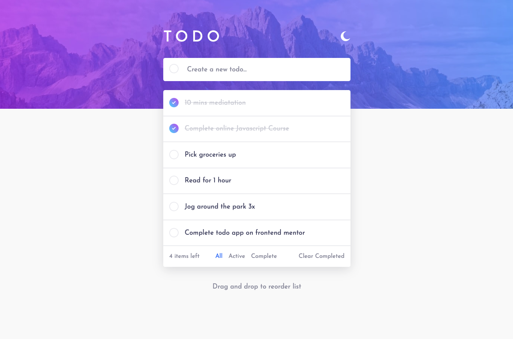
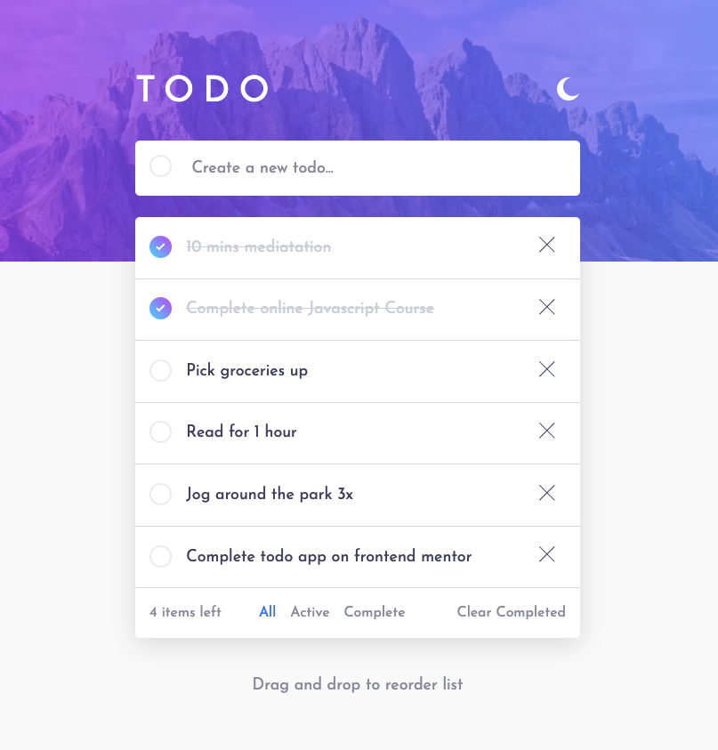
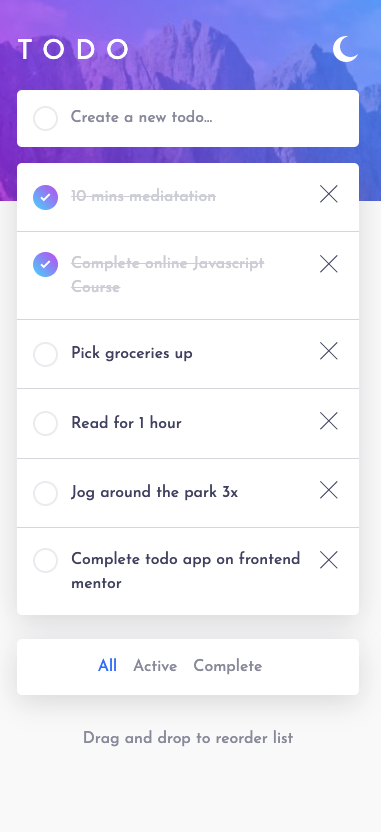
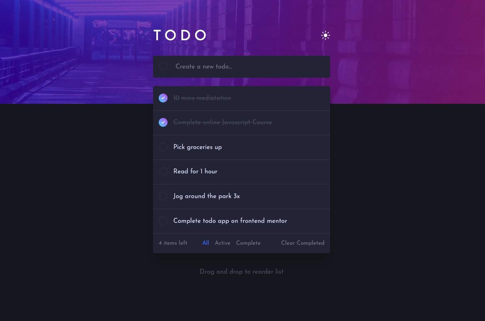
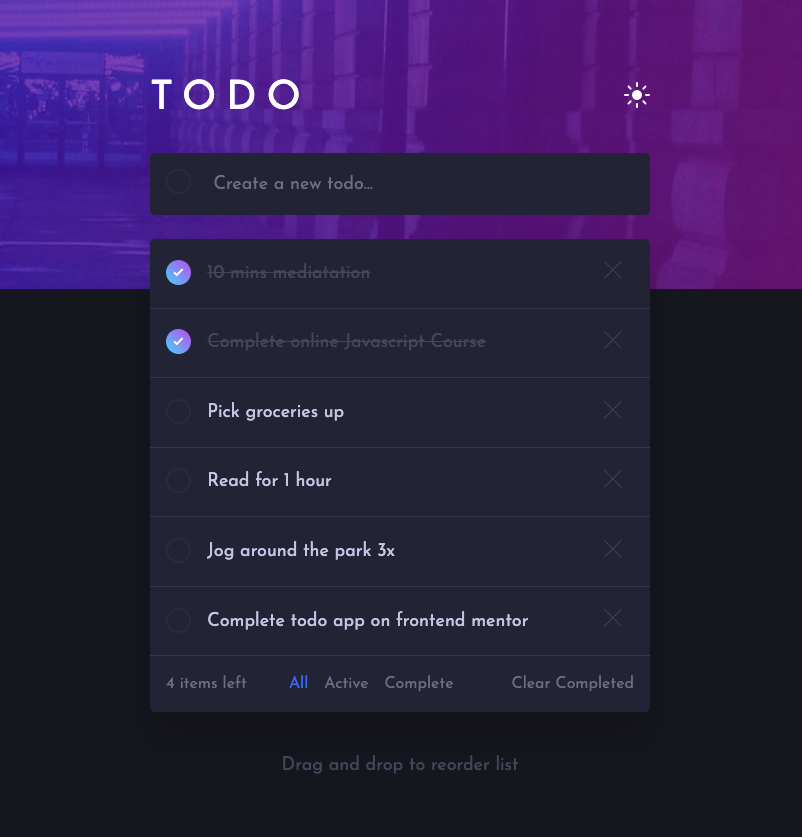
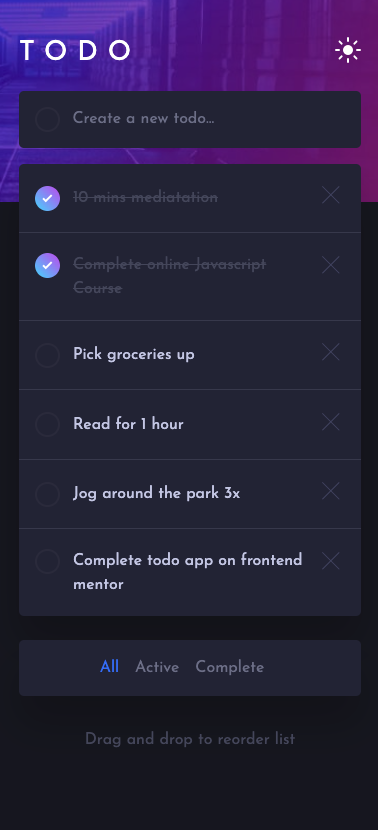

# Frontend Mentor - Todo app solution

This is a solution to the [Todo app challenge on Frontend Mentor](https://www.frontendmentor.io/challenges/todo-app-Su1_KokOW). Frontend Mentor challenges help you improve your coding skills by building realistic projects.

## Table of contents

- [Overview](#overview)
  - [The challenge](#the-challenge)
  - [Screenshot](#screenshot)
  - [Links](#links)
- [My process](#my-process)
  - [Built with](#built-with)
  - [What I learned](#what-i-learned)
  - [Continued development](#continued-development)
  - [Useful resources](#useful-resources)
- [Author](#author)
- [Acknowledgments](#acknowledgments)

**Note: Delete this note and update the table of contents based on what sections you keep.**

## Overview

### The challenge

Users should be able to:

- View the optimal layout for the app depending on their device's screen size
- See hover states for all interactive elements on the page
- Add new todos to the list
- Mark todos as complete
- Delete todos from the list
- Filter by all/active/complete todos
- Clear all completed todos
- Toggle light and dark mode
- **Bonus**: Drag and drop to reorder items on the list

### Screenshot








### Links

- Solution URL: [github](https://github.com/btebe/todo-app)
- Live Site URL: [vercel](https://todo-app-ten-weld.vercel.app/?filter=all)

## My process

### Built with

- Semantic HTML5 markup
- CSS custom properties
- Flexbox
- CSS Grid
- [Next.js](https://nextjs.org/) - React framework
- prisma
- mysql
- react-beautiful-dnd

### What I learned

For this project i used Nextjs and that was a big learning curve for me. The reason why i took so long to finish this project was because i made it a full stack project. Here are the topics that helped achieved this project:

- how to create circle with inner circle css [1]
- how to change parent background when hover on child [2]
- how to select Image nextjs in css [3]
- react-beautiful-dnd issue occured: SERVE != CLIENT ID ISSUE [4]
- Drag and drop sample code [5]
- Unable to find draggable with id 5 [6]
- Api routes in next js [7]
- prisma basics [8]
- Local storage persist on refresh [9]
- Prisma seeding [10]
- Grab and drop item db update logic [11]
- how to play with url without refreshing or changing page [12]

To see how you can add code snippets, see below:

```html
<div className="task">
  <input type="checkbox" name="check" />
  <label className="task-label">
    <span className="custom-checkbox-border">
      <span className="custom-checkbox"></span>
    </span>
    <p>text</p>
  </label>
  <div className="image-Wrapper" onClick="{handleDelete}">
    
  </div>
</div>
```

```css
[type="checkbox"] {
  opacity: 0;
  position: absolute;
}
.custom-checkbox {
  --size: 84%;
  width: var(--size);
  height: var(--size);
  border-radius: 50%;
  display: inline-block;
  pointer-events: auto;
  background: var(--checbox-bg);
}
.custom-checkbox-border {
  pointer-events: none;
  align-self: start;
  --size: 25px;
  display: flex;
  align-items: center;
  justify-content: center;
  width: var(--size);
  height: var(--size);
  border-radius: 50%;
  background: var(--checkbox-border);
}
```

### Continued development

I still need to further develop my skill in nextjs by using it in my future projects.

### Useful resources

- [1](https://stackoverflow.com/questions/46684565/how-to-center-a-inner-circle-using-css) - This helped me to center a circle within a circle to act as a border for my custom checkbox. I read and tried that it is not possible to set ordinary border field to have linear gradient. This is why this solution helped.
- [2](https://stackoverflow.com/questions/8114657/how-to-style-the-parent-element-when-hovering-a-child-element) - This helped me with my custom checkbox to achieve the hover effect and style i need.
- [3](https://www.peterlunch.com/snippets/next-image-styling) - This helped me to learn more about the image component in nextjs because nextjs doesnt use normal img for some reason.
- [4](https://stackoverflow.com/questions/64242578/how-to-fix-data-rbd-draggable-context-id-did-not-match-server-1-client-0/64242579#64242579) - This helped solve some issues with react-beautiful-dnd. for me the solution was not the recommened one but another,which is to create state for browser and set "setIsBrowser(process.browser);" and wrap DragDropContext with isBroswer, but process.browser is deprecated. the solution was to use "typeof window === 'undefined'" but that didnt work. what worked for me was "typeof window !== 'undefined'". This is all to distinguish between server environment and client environment in nextjs.
- [5](https://contactmentor.com/react-drag-drop-list/) - This is tutorial that helped me achieve the drag and drop in my project.
- [6](https://stackoverflow.com/questions/60029734/react-beautiful-dnd-i-get-unable-to-find-draggable-with-id-1) - This helped solve some issues with react-beautiful-dnd. for me the solution was not the recommened one but another, which is to set strict mode to false then reset the server.
- [7](https://www.youtube.com/watch?v=k-Hv0ZneqYM&t=414s) - This helped me understand how to create api routes in nextjs.
- [8](https://www.youtube.com/watch?v=aim8Mk-ETK0&t=1775s) - This helped me understand prisma better.
- [9](https://spacejelly.dev/posts/how-to-save-state-to-localstorage-persist-on-refresh-with-react-js/) - This helped me understand how to handle local storage in nextjs
- [10](https://planetscale.com/blog/how-to-seed-a-database-with-prisma-and-next-js) - This helped me seed my database by using javascript instead of typescript.
- [11](https://betterprogramming.pub/the-best-way-to-update-a-drag-and-drop-sorting-list-through-database-schemas-31bed7371cd0) - This helped me understand the concept of array structure scheme which is essential inorder to update Db when list with grab and drop has been altered.
- [12](https://nextjs.org/docs/routing/shallow-routing) - This introduces shallow routing which will help to play with url without directing to another page refresh getserversideprops and more

## Author

- Website - [Basma Tebe](https://basma94tebe.wixsite.com/my-site)
- Frontend Mentor - [@btebe](https://www.frontendmentor.io/profile/btebe)

## Acknowledgments

I would like to give my gratitude to all the people above that are mentioned in my useful resources section. Also, i would like to give appreciation to the whole wide web for making alot of resources available.
